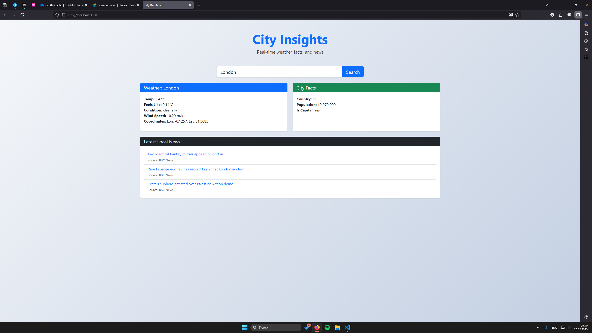

# backend-course

## Assignment 2

### Project Description

City Insights is a robust backend-driven web application designed to provide users with a comprehensive overview of a city's current status. By aggregating data from three distinct third-party APIs, the application delivers real-time weather metrics, demographic city facts, and the latest local news headlines through a single, unified interface.

### Installation

1. Clone the repository
2. Install dependencies:
   `npm install`

### Running the Server

Start the server:
   `npm start`

Server will run on `http://localhost:3000`

### Screenshots

Main Page

London Results

Astana Results

Responsive Design Mobile

